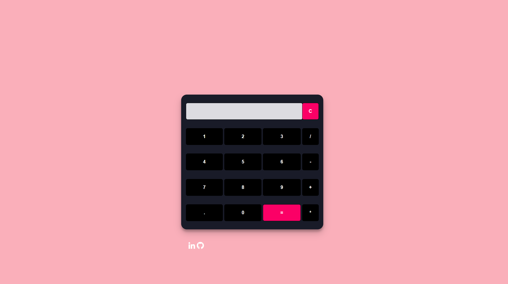

# overview📝
As we know, the Calculator is a portable device used in our daily life to perform various mathematical functions such as addition, subtraction, multiplication, division, root, etc.
In this repository I create a simple calculator | Languages used => HTML, CSS, JavaScript.

# Prerequisites🛠️
Text editor(Visual Studio OR Atom) 
Basic understanding of JavaScript ,HTML and CSS. 

# Project View🔍
 
 

# Demo💻  
https://melafalnusiry.github.io/calculator/  

